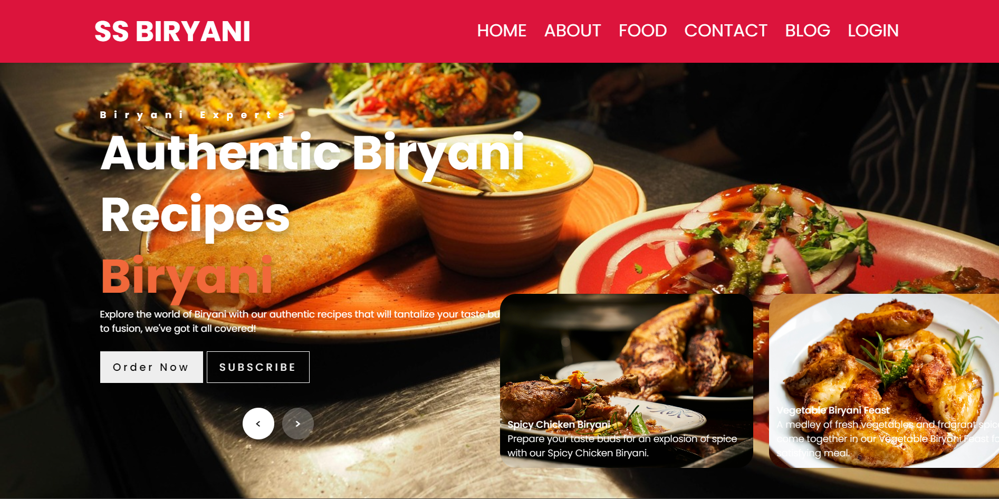
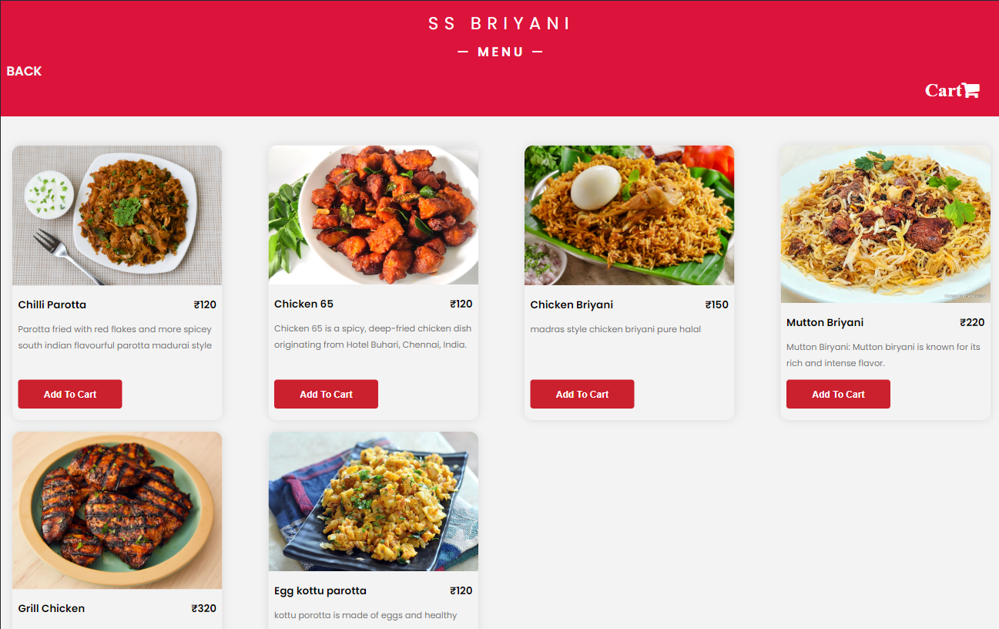
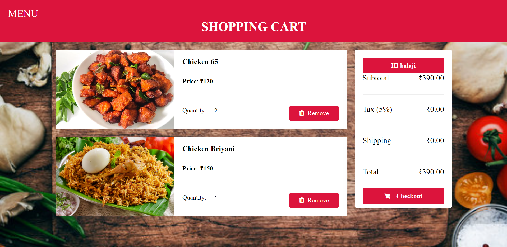
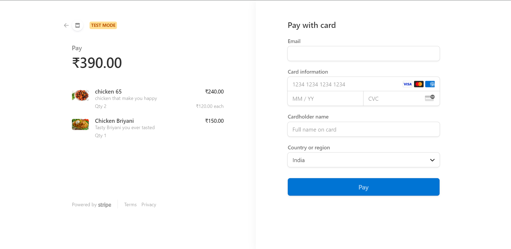

# Food Provider Website with Flask and MongoDB

## Overview

Developed using Flask and MongoDB, this dynamic restaurant website offers a robust platform for customers to explore and order meals online. The site focuses on ensuring secure user authentication, streamlined user navigation, and effective front-end to back-end integration.

## Key Features

- Responsive design ensures a seamless experience across all devices, from mobile to desktop.
- Enhanced security features with a comprehensive user authentication system.
- User-friendly interfaces designed for effortless navigation and interaction.
- An administrative dashboard for efficient management of menu items.
- Integrated payment processing facilitated through Stripe, ensuring secure and straightforward transactions.

## Installation Guide

To get the restaurant website up and running on your local environment, follow these steps:

1. Extract the downloaded project files.
2. Navigate to the folder named `foodWebsiteFlaskv4`.
3. Open your terminal at this location.
4. Set up a virtual environment: `python -m venv .venv`
5. Adjust permissions: `Set-ExecutionPolicy -Scope CurrentUser Unrestricted`
6. Activate the virtual environment: `.venv/Scripts/activate`
7. Install necessary libraries: `pip install -r requirements.txt`
8. Start the server: `flask run` or `python app.py`
9. To populate your database with sample menu items, use the included `food_website.food_items.json` file.

## Screenshots

Here are a few screenshots demonstrating the website's features:
- **Homepage:** 
- **Menu Page:** 
- **Cart Page:** 
- **Payment Process:** 

## Acknowledgements

I extend my gratitude to Shobana for her invaluable guidance and support throughout this project's development. Recognition is also due to the Flask and MongoDB communities for their outstanding resources and support.
